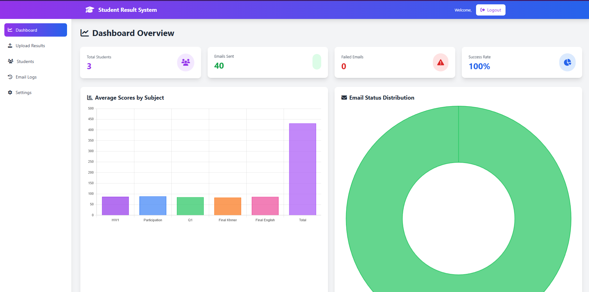

# Portfolio Website

This project is a simple and clean **Web Developer Portfolio Website** to showcase your skills, projects, and personal information.

## 🚀 Features

* Responsive layout
* Sections for About, Skills, Projects, and Contact
* Easy to update and customize
* Modern and clean UI

## 📂 Project Structure

```
profolio-web-developer/
│
├── index.html
└── images/
    ├── images/
    └── people/
```

## 🛠️ Technologies Used

* **HTML5** – Structure of the website
* **CSS3** – Styling and layout
* **JavaScript** – Interactivity

## 📌 How to Use

1. Clone this repository:

   ```bash
   git clone https://github.com/Narith-hen/profolio-web-developer.git
   ```
2. Open the project folder.
3. Run `index.html` in your browser.
4. Edit the text, images, and styles as you like.

## 💡 Customization

* Update your **About Me** text in `index.html`
* Add your skills in the Skills section
* Add your projects in the Projects section
* Replace images inside `images/`


## 🌐 Live Demo

live demo [Click here](https://profolio-web-developer.vercel.app/)


## 🖼️ Screenshots

Project 1



Project 2


